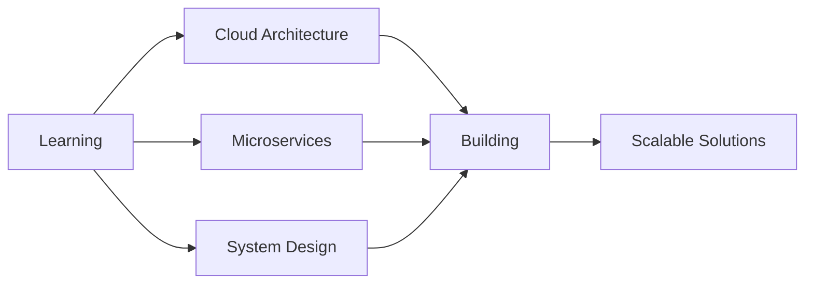

<div align="center">

# 👋 Welcome to My Digital Workspace


<br/>

[](https://github.com/herathdeelaka730-cell)
[](https://github.com/herathdeelaka730-cell?tab=followers)
[](https://github.com/herathdeelaka730-cell)

</div>

---

## 🚀 About Me

```typescript
const deelaka = {
    location: "Sri Lanka 🇱🇰",
    role: "Full-Stack Software Engineer",
    focus: ["Web Development", "Mobile Apps", "IoT Solutions"],
    currentlyLearning: ["Cloud Architecture", "Advanced Android", "Firebase"],
    techStack: {
        backend: ["Node.js", "PHP", "Express.js", "Spring Boot"],
        frontend: ["React", "Angular", "HTML5", "CSS3"],
        mobile: ["Android", "React Native", "Flutter"],
        databases: ["Oracle", "MySQL", "MongoDB", "Firebase"],
        tools: ["Git", "Docker", "Figma", "VS Code"]
    },
    goals2024: "Build scalable systems & contribute to open source 🌟",
    funFact: "I debug for fun and optimize for satisfaction ⚡"
};
```

<div align="center">
  
### 💡 "Code is like humor. When you have to explain it, it's bad." – Cory House

</div>

---

## 🛠️ Technology Arsenal

<div align="center">

### 📱 Mobile & Frontend


### ⚙️ Backend & Databases


### 🔧 Tools & Platforms


</div>

---

## 📊 GitHub Analytics

<div align="center">
  


</div>

<div align="center">
  
### 🏆 GitHub Trophies
[](https://github.com/ryo-ma/github-profile-trophy)

</div>

---

## 🎯 Current Focus

<div align="center">



</div>

🔭 **Working On:** Building scalable web applications with modern tech stacks  
🌱 **Currently Learning:** Advanced cloud architecture and distributed systems  
👯 **Looking to Collaborate On:** Open source projects and innovative IoT solutions  
💬 **Ask Me About:** Full-stack development, Android, Firebase, or anything tech!  
⚡ **Fun Fact:** I find joy in optimizing algorithms and making code elegant  

---

## 📫 Let's Connect!

<div align="center">

[](https://github.com/herathdeelaka730-cell)
[](https://linkedin.com/in/YOUR_USERNAME)
[](mailto:your.email@example.com)
[](https://your-portfolio.com)

</div>

---

<div align="center">

### 💭 Quote of the Day


### 🐍 Contribution Snake


---

### ⭐ Show Some Love!
*If you like my work, consider giving my repositories a star!*


**Thanks for visiting! Let's build something amazing together! 🚀**

</div>
